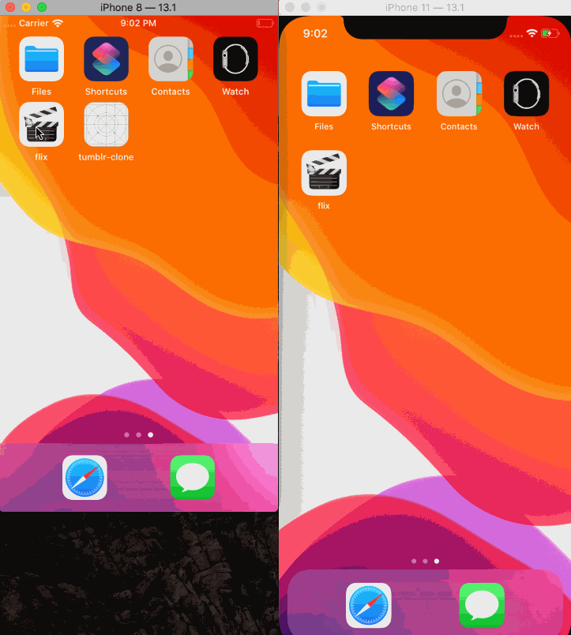

# Flix

Flix is an app that allows users to browse movies from the [The Movie Database API](http://docs.themoviedb.apiary.io/#).

---

## Flix Part 1

### User Stories

#### REQUIRED (10pts)
- [X] (2pts) User sees an app icon on the home screen and a styled launch screen.
- [X] (5pts) User can view and scroll through a list of movies now playing in theaters.
- [X] (3pts) User can view the movie poster image for each movie.

#### BONUS
- [X] (2pt) User can view the app on various device sizes and orientations.
- [X] (1pt) Run your app on a real device.

### App Walkthough GIF

GIF created with [LiceCap](http://www.cockos.com/licecap/).

### Notes
Implementing auto-layout for different device sizes was a bit tricky, but I got it working!

I also ran into some issues when I tried to run my app on my device, but after some searching on StackOverflow I got it to work.